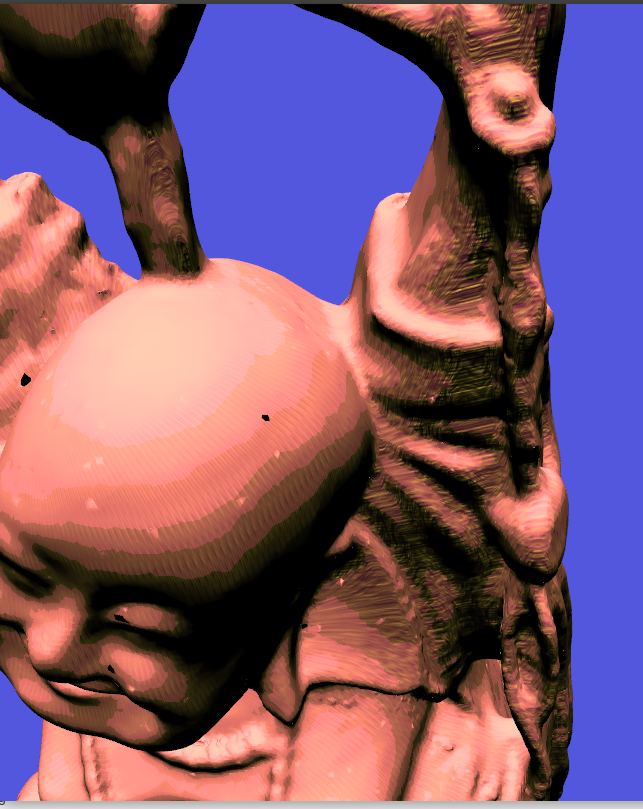

# Simple Hatching Shader


This is a simple code demonstrating how to use [TensorViz]() for
rendering objects with [hatching](https://en.wikipedia.org/wiki/Hatching)
in place of the standard gourad shading.



This was based on the paper [Praun, Emil, et al. "Real-time hatching."
Proceedings of the 28th annual conference on Computer graphics and
interactive techniques. 2001.](http://hhoppe.com/hatching.pdf)

## Try it using Docker

The script [`tv-try`](tv-try) launches a docker image containg all dependencies of TensorViz.

```shell
shadow-mapping$ ./tv-try demo.py <input-object>
```

Or use the rule `docker-demo-buddha` from the Makefile.

```shell
shadow-mapping$ make docker-demo-buddha
```

## Try it using the source code.

Install TensorViz into your environment following the instructions on
its [repository](https://gitlab.com/mipl/3d-reconstruction/tensorviz).

Run the rule `demo-buddha-highres`, to download the Buddha from the
[Standord 3D Scanning
Repository](http://graphics.stanford.edu/data/3Dscanrep/) and run the
demo.

```
$ make demo-budha-highres
```

